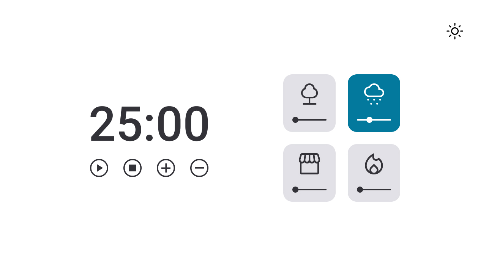
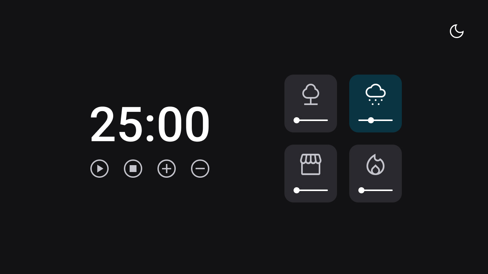

<h1 align="center"> Focus Timer 2.0</h1>

Repositório do desafio Focus Timer 2.0 do stage 05 da turma 09 do explorer, o objetivo era criar uma página com um contador regressivo com dois modos de visualização (light mode e dark mode). 

  <a href="#technologies">Technologies</a>&nbsp;&nbsp;&nbsp;|&nbsp;&nbsp;&nbsp;
  <a href="#project">Project</a>&nbsp;&nbsp;&nbsp;|&nbsp;&nbsp;&nbsp;
  <a href="#layout">Layout</a>

 

## 🚀 Technologies

Esse projeto foi desenvolvido com as seguintes tecnologias:

- HTML e CSS
- JavaScript
- Git e Github
- Figma

## 💻 Project

O projeto consiste em uma página com um contador regressivo onde o usuário poderá acrescentar ou diminuir minutos da contagem, escolher entre 4 sons diferentes para ouvir enquanto está na página, além das funcionalidades de play e stop do tempo do contador. Um alerta sonoro é disparado para informar ao usuário que o tempo chegou a 00:00.

- [Visite o projeto online]()

## 🔖 Layout

Você pode visualizar o layout do projeto através [DESSE LINK](https://www.figma.com/file/nlJJAVuGDc1tnDKqUW4FJA/Stage-05---Dark-Mode-FocusTimer/duplicate). É necessário ter conta no [Figma](https://figma.com) para acessá-lo.

---

Made with 💜 by raulrodmo

